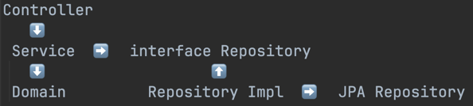

### 추상화란?
* 복잡한 모듈에서 핵심적인 개념과 기능을 간추려내는 것
* 그렇게 하여 모듈간에 결합도를 낮추고 격리하고 인터페이스를 만드는 것
* 하면 좋겠지만, 추상화를 하기 시작하면 끝도 없이 갈 수 있다.

### 어디까지 추상화해야 하는가?
* 외부 시스템 연동은 일단 무조건하자.(JPA, WebClient, RestTemplate 등)
  * JPA를 서비스레이어에서 바로 사용하지 말고, repository 인터페이스를 사용하도록 한다.
  * 이를 영속성레이어에서 구현하고, 구현체는 JPA를 주입받아 사용하도록 한다.
  * 구현체에서는 JPA를 사용하여 나온 DB 엔티티를 도메인 엔티티로 변환하여 반환한다.
  * 이렇게 DB 엔티티와 도메인 객체를(PO와 도메인을) 분리할 수 있다.
  * 물론, 도메인 엔티티를 따로 분리하여 사용하지 않아도 의존성역전 때문에 충분히 좋은 방법이다.
  * 이 방법을 통해 OCP를 지킬 수 있으며, JPA 대신 다른 라이브러리를 사용하더라도 교체가 쉽다.
  * 또한 구현체를 갈아끼워서 JPA나 Mock없이 테스트하기 편하다.
* 서비스와 컨트롤러는 따로 추상화하지 않는다.
  * 서비스와 컨트롤러는 한번 생성으로 영원히 같은 일을 하는 객체여야 하기 때문이다.
* 도메인 계층을 추가로 둔다.

### 완성된 계층 그림
