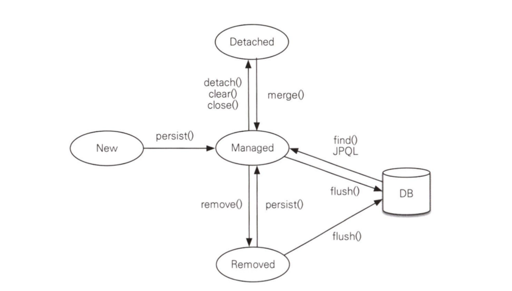

# 영속성 컨텍스트

- 영속성 컨텍스트는 **엔티리를 영구 저장하는 환경**이다.
- 엔티티 매니저로 엔티티를 저장하거나 조회하면 엔티티 매니저는 영속성 컨텍스트에 엔티리를 보관하고 관리한다.

```java
em.persist(member);
```

- 위 코드로 엔티티는 DB에 저장되는 것이 아니라, 영속성 컨텍스트에 저장된다.

## 엔티티 생명주기



- 비영속 : 영속성 컨텍스트와 전혀 관계가 없는 상태, 엔티티 객체를 생성한 상태이다.
- 영속 : 영속성 컨텍스트에 저장된 상태, 엔티티 객체를 `persist()`하여 저장한 상태이다.
- 준영속 : 영속성 컨텍스트에 저장되었다가 분리된 상태
- 삭제 : 삭제된 상태

## 영속성 컨텍스트의 특징

- 영속성 컨텍스트 내에서 엔티티는 식별자값으로 구분된다. 식별자가 무조건 존재해야 한다.
- 영속성 컨텍스트에 저장된 엔티티는 커밋하는 순간 해당 내용을 데이터베이스 반영한다. (commit/flush)
- 영속성 컨텍스트를 사용하는 이점은 다음과 같다.
  - 1차 캐시
  - 동일성 보장
  - 쓰기 지연 (트랜잭션 보장)
  - 변경 감지
  - 지연 로딩

### 1차 캐시

- 엔티티를 영속성 컨텍스트에 `persist()`하면 1차 캐시에 저장된다.
- `find()` 호출시 영속성 컨텍스트는 먼저 1차 캐시에서 해당 엔티티를 찾는다.
- 1차 캐시에 없는 경우에는 DB에서 찾게 된다. 또한 찾은 정보를 1차 캐시에 저장한다.
  - 따라서 다음부터는 1차 캐시로 빠르게 찾을 수 있게 된다.

### 동일성 보장

- 영속성 컨텍스트에서 같은 식별자의 엔티티를 여러번 찾으면 엔티티는 1차 캐시에 있는 같은 엔티티가 조회된다.
- 따라서 두 엔티티의 동일성이 보장된다.
- **동등성이 아니다. 두 엔티티는 정확하게 일치하는 동일한 객체이다.**

### 쓰기 지연

- 영속성 컨텍스트에는 **쓰기 지연 SQL 저장소**가 존재한다.
- 엔티티를 영속성 컨텍스트에 `persist()` 하면 엔티티 객체가 1차 캐시에 저장될 뿐 아니라, 쓰기 지연 저장소에 SQL문도 쌓이게 된다.
- 추후에 `commit()`하면 `flush()`가 먼저 호출되는데, 이때 저장되어 있던 SQL문을 한번에 보낸다.
- 트랜잭션이 시작되고, 여러 정보들을 쓰다가 문제가 발생하면 `commit()`이 호출되지 않는다. 따라서 트랜잭션은 실패한다. (트랜잭션 보장)

### 변경 감지

- 영속 상태의 엔티티는 1차 캐시에 최초 **스냅샷**이 같이 저장된다.
- 해당 엔티티의 내부 값이 수정되었다고 가정했을 때, `flush()` 되기 전, 영속성 컨텍스트는 스냅샷과 현재 상태를 비교하고, 만약 변경되었다면 해당 수정 사항을 수정 SQL로 만들어 한번에 쿼리한다.
- **이 작업은 영속 상태의 엔티티에만 적용된다.**
- 이렇게 생성되는 쿼리는 모든 칼럼을 포함하는데, 이는 쿼리의 재사용성 때문이다. 칼럼이 많아지면 성능이 떨어지므로 수정이 필요해진다. (정말 많아야 된다.)

## 플러시

- `flush()`는 직접 호출할 수도 있지만, 트랜잭션 커밋시에 자동으로 호출된다.
  - 또한 JPQL 실행시에 자동으로 호출되는데, 이는 아직 쓰기 지연 저장소에 있는 변경 사항을 DB에 반영하지 않은 채로 SQL문 실행시 정합성에 문제가 생기기 때문이다.
- `flush()`가 호출되면 벌어지는 일을 다시 정리해보자.

1. 변경 감지 : 1차 캐시의 모든 엔티티를 스냅샷과 비교하여 수정된 엔티티를 찾는다. 수정된 엔티티는 수정쿼리가 작성되어 쓰기 지연 저장소에 저장된다.
2. 쓰기 지연 : 쓰기 지연 저장소에 저장되었던 모든 SQL이 한번에 DB에 반영한다.

## 준영속

- 비영속 -> 영속 -> 삭제 상태 변화는 이해했다.
- 영속 -> 준영속 상태 변화는 언제 일어날까?
  - `detach()` : 특정 엔티티를 준영속 상태로 만든다.
  - `clear()` : 영속성 컨텍스트를 초기화한다. 모든 엔티티가 준영속 상태가 된다.
  - `close()` : 영속성 컨텍스트를 종료한다.
- 준영속 -> 영속 상태 변화
  - `merge()` : 준영속 상태의 객체를 받아서 **영속 상태의 새로운 객체를 반환한다.**

### 준영속 상태가 되면

- 1차 캐시에서 제거된다. Id-Entity-Snapshot 정보가 모두 사라진다.
- 쓰기 지연 저장소에서 제거된다. 관련 SQL 문이 모두 사라진다.

### 준영속 상태의 특징

- 비영속 상태에 가깝다. 영속성 컨텍스트가 제공하는 그 어떠한 기능이 제공되지 않는다.
- 따라서 지연 로딩이 불가하다. : 많이 겪게 되는 문제점이니 꼭 기억하자.
