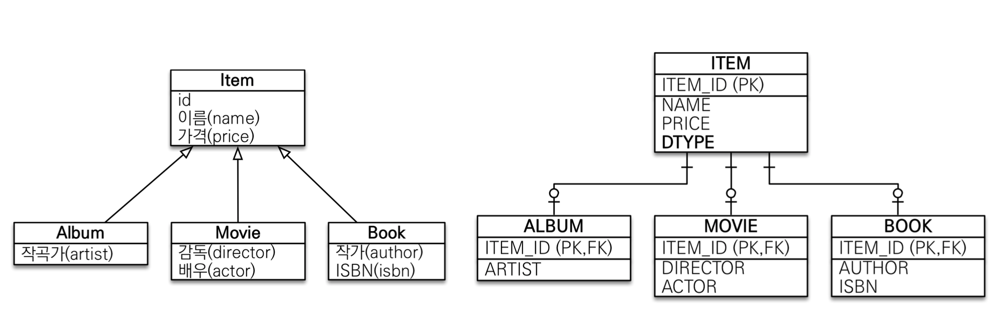
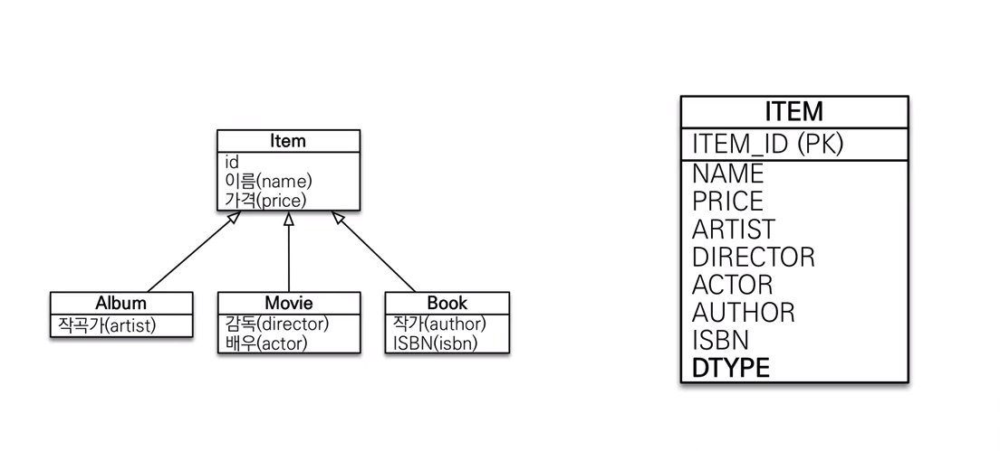
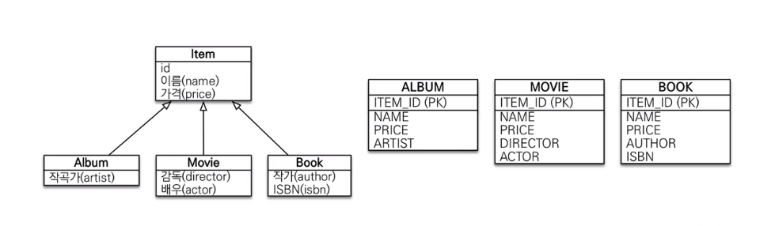

# 상속 관계 매핑

- DB에서는 상속관계를 나타낼 수 없다. 따라서 객체 관계에서의 상속을 DB에서 어떻게 표현할 것인가가 문제이다.
- 여러 전략들을 통해 간접적으로 나타낼 수 있다.

## 조인 전략



- 부모 테이블, 자식 테이블을 모두 만든다.
- 특정 로우가 어떤 타입인지 알기 위한 칼럼이 하나 추가된다.
- 부모 테이블에 있는 칼럼을 참조해야 할 때는 **조인**한다.
- 자식 테이블은 부모 테이블의 PK를 받아서 PK/FK로 사용한다.

```java
@Entity
// 상속 타입
@Inheritance(strategy = InheritanceType.JOINED)
// 타입 구분 칼럼 이름
@DicriminatorColumn(name = "DTYPE")
public abstract class Item {
    
    @Id
    @GeneratedValue
    @Column (name = "ITEM_ID")
    private Long id;
    
    private String name;
    private int price;
}

@Entity
// 타입 구분 칼럼 값
@DicriminatorValue("A")
public class Album extends Item {
    
    private String artist;
    // ...
}


@Entity
// 타입 구분 칼럼 값
@DicriminatorValue("M")
public class Movie extends Item {
    
    private String director;
    // ...
}

@Entity
// 타입 구분 칼럼 값
@DiscriminatorValue("B")
// 기본키 재정의
@PrimaryKeyJoinColumn(name = "BOOK_ID")
public class Book extends Item {
    
    private String author;
    // ...
    
}
```

## 단일 테이블 전략



- 통째로 하나의 테이블로 만든다.
- 특정 로우가 어떤 타입인지 알기 위한 칼럼이 하나 추가된다.

```java
@Entity
@Inheritance(strategy = InheritanceType.SINGLE_TABLE)
@DiscriminatorColumn(name = "DTYPE")
public abstract class Item {
	
    @Id
    @GeneratedValue
    private Long id;
    
    private String name;
    private int price;
}

@Entity
@DicriminatorValue("A")
public class Album extends Item {
    
    private String artist;
    // ...
}

@Entity
@DicriminatorValue("M")
public class Movie extends Item {
    
    private String director;
    // ...
}

@Entity
@DiscriminatorValue("B")
public class Book extends Item {
    
    private String author;
    // ...
}
```

## 구현 클래스마다 테이블 전략



- 중복을 허용하고, 구현 클래스만 테이블로 만든다.

```java
@Entity
@Inheritance(strategy = InheritanceType.TABLE_PER_CLASS)
public abstract class Item {
	
    @Id
    @GeneratedValue
    private Long id;
    
    private String name;
    private int price;
}

@Entity
public class Album extends Item {
    
    private String artist;
    // ...
}

@Entity
public class Movie extends Item {
    
    private String director;
    // ...
}

@Entity
public class Book extends Item {
    
    private String author;
    // ...
}
```

## @MappedSuperclass


- 상속관계매핑과 다르다. 이 방법은 DB 상에서 상속관계를 나타내는 것이 아니다.
- 이 방법은 DB는 그대로 냅두고, 객체 간에 공통되는 부분을 뽑아내기 위해 사용한다.

```java
@MappedSuperclass
public abstract class BaseEntity {​

    @Id
    @GeneratedValue
    private long id;

    @Column
    private LocalDateTime lastModifiedDate;
}

@Entity
public class Member extends BaseEntity {

    @Column
    private String name;

    @Column
    private String height;
}

@Entity
public class Team extends BaseEntity {

    @Column
    private String region;
}
```
