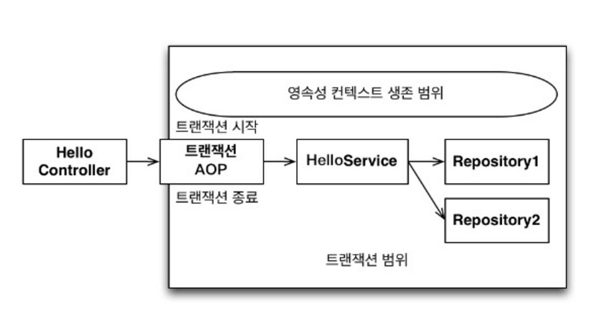

# 트랜잭션 범위의 영속성 컨텍스트

> 들어가며
>
> 이번 장에서 설명하는 내용은 **영속성 컨텍스트의 범위**를 설정하는 내용이다.
>
> 내가 공부하고 있는 API 서버를 만드는 상황에서는 DTO를 사용하여 해결하는 것이 주류가 되었다는 점을 생각하며 공부하자.
>
> [open-in-view의 위험성](https://medium.com/frientrip/spring-boot%EC%9D%98-open-in-view-%EA%B7%B8-%EC%9C%84%ED%97%98%EC%84%B1%EC%97%90-%EB%8C%80%ED%95%98%EC%97%AC-83483a03e5dc)

## 예제 코드

```java
@RestController
@RequiredArgsConstructor
public class HelloController {
    
    private final HelloService helloService;
    
    @GetMapping("/{name}")
    public HelloResponse hello(@PathVariable String name) {
        Member result = helloService.getMemberWithName(name);
        return new HelloResponse(
                result.getName(),
                result.getTeam().getName()
        );
    }
}

@Service
@RequiredArgsConstructor
public class HelloService {
    
    private final MemberRepository memberRepository;
    
    @Transactional
    public Member getMemberWithName(String name) {
        Member member = memberRepository.findByName(name);
        return member;
    }
}
```

## 스프링 컨테이너의 기본 전략

- **트랜잭션 범위의 영속성 컨텍스트**를 기본으로 사용한다.
- 즉, 트랜잭션이 적용되는 범위만큼 영속성 컨텍스트가 유지된다.



- JPA는 AOP의 메서드가 정상 종료되기 전에 영속성 컨텍스트를 플러시하여 DB에 반영하고 트랜잭션을 커밋한다.
- 정상 종료되지 않을 경우에는 플러시를 호출하지 않고 트랜잭션을 롤백한다.

## 트랜잭션과 영속성 컨텍스트의 관계

- **트랜잭션이 같으면 같은 영속성 컨텍스트를 사용한다.**
  - 트랜잭션만 같으면 다양한 위치에서 영속성 컨텍스트를 주입받아 사용해도 같은 것을 사용한다.
- **트랜잭션이 다르면 다른 영속성 컨텍스트를 사용한다.**
  - 트랜잭션이 다르면 같은 위치에서 영속성 컨텍스트를 주입받아 사용해도 다른 것을 사용한다.
