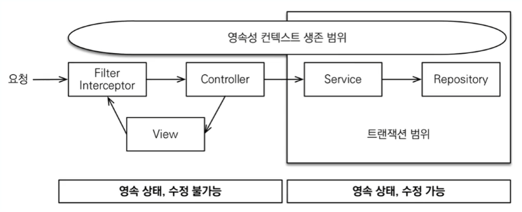

# OSIV

- 앞선 문제들은 컨트롤러에서 영속성 컨텍스트가 끝나고, 모든 엔티티가 준영속 상태가 되기 때문에 발생했다.
- 그러면 컨트롤러에서도 영속성 컨텍스트를 살려놓으면 해결되지 않을까?
- 이 방법이 OSIV(Open Session In View)이다.

- OSIV를 통해 컨트롤러에서도 영속성 컨텍스트를 유지하여 **지연 로딩**을 가능케 한다.
- 단, 트랜잭션의 범위는 서비스까지로 한정지어, 컨트롤러에서의 수정 가능성은 없앤다.
- **트랜잭션이 없는 읽기**라고도 부른다.
- OSIV는 **기본적으로 켜져있으며**, `spring.jpa.open-in-view=false`로 끌 수 있다.

## OSIV 사용시 문제점

### 엔티티 수정 가능성

- 먼저, 컨트롤러에서 엔티티를 수정하면 영속성 컨텍스트에 작성은 된다.
- 하지만 트랜잭션이 종료되었기 때문에 커밋되지 않을 뿐이다.
- 따라서 만약에 서비스를 통해 엔티티를 얻은 컨트롤러가 이를 수정하고, 다시 서비스를 호출하게 된다면? 해당 서비스의 트랜잭션이 커밋되며, 컨트롤러에서의 수정사항도 같이 커밋되어 버릴 것이다.

### 성능

- 영속성 컨텍스트가 오래 지속되기 때문에 성능이 안좋다.
- 뷰 계층에서 의도치않은 지연 로딩이 발생하여 N+1 문제가 발생할 수 있다.
