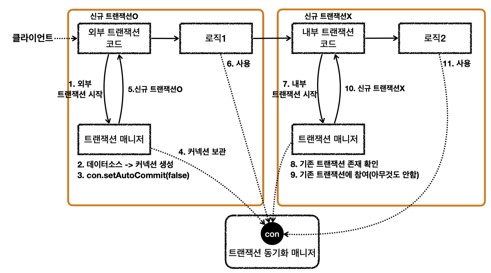

# 트랜잭션 전파란?

- 만약 한 트랜잭션 코드를 실행하고, 이어서 다른 트랜잭션 코드를 실행한다고 가정해보자.
  - 그렇다면 두 트랜잭션은 다르고, DB 커넥션도 다르고, 영속성 컨텍스트도 다를 것이다.
  - 따라서 한 트랜잭션이 롤백되더라도 상관없이 다른 트랜잭션은 커밋될 수 있다.
- 하지만 만약 한 트랜잭션 코드 안에 다른 트랜잭션 코드가 존재하면 어떻게 될까?
  - **이 경우에는 트랜잭션이 이어지는 와중에 다른 트랜잭션 코드를 만난다.**

## 트랜잭션 전파

- 트랜잭션 전파 기본 옵션 `REQUIRED`를 기준으로, 하나의 큰 트랜잭션으로 묶인다.
- 이렇게 묶이는 큰 트랜잭션을 물리 트랜잭션이라고 부르고, 작은 두개의 트랜잭션을 논리 트랜잭션이라고 부른다.

### 논리 트랜잭션과 물리 트랜잭션

- 트랜잭션 전파 옵션에 따라 논리/물리 트랜잭션의 설정이 달라질 수 있다.
- 하지만 다음 규칙은 무조건 지켜진다.
  - 모든 논리 트랜잭션이 커밋되어야 물리 트랜잭션이 커밋된다.
  - 논리 트랜잭션이 하나라도 롤백되면 물리 트랜잭션이 롤백된다.

## 트랜잭션 전파 동작 방식

- 트랜잭션 매니저는 외부 트랜잭션을 생성한 결과를 트랜잭션 동기화 매니저에 저장한다.
  - 이때, 신규 트랜잭션 여부를 같이 저장한다.
- 트랜잭션 매니저는 내부 트랜잭션을 생성할 때, 신규 트랜잭션이 아니라는 것을 확인하고 기존 트랜잭션에 참여한다.
  - 참여한다기보다는, 아무것도 하지 않는다. (그대로 기존 트랜잭션을 잇는다.)

