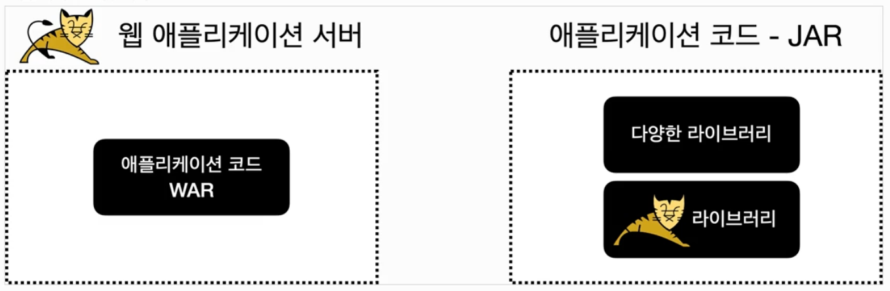

# 외장 서버 vs 내장 서버

## 외장 서버

- 전통적인 방식
- WAS가 별도로 설치한다.
- WAS에서 동작하도록 서블릿 스펙에 맞추어 코드를 작성하고 WAR 형식으로 빌드한다.
- 이렇게 만들어진 war 파일을 WAS에 전달하여 배포한다.
- 즉, WAR 빌드 -> WAS 위에서 실행의 두 단계로 배포할 수 있다.

## 내장 서버

- 스프링부트 덕분에 톰캣같은 WAS가 라이브러리로 내장되어 있다.
- 개발자는 코드를 작성하고 JAR로 빌드하면 된다.
- JAR 파일 안에 다양한 라이브러리와 톰캣 라이브러리도 같이 포함되어 있다.
- JAR 파일 그 자체로 실행하면 내장 서버가 띄워진다.
