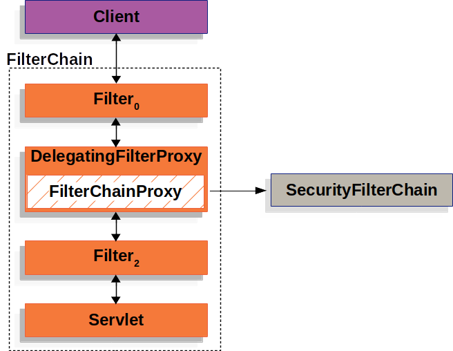

# 시큐리티 기본 구조

> 이 시리즈를 통해 스프링 시큐리티의 기본 구조를 파악한다.
>
> 거의 모든 내용은 [개발자 유미님의 블로그](https://www.devyummi.com/page?id=6695e062d31df967ae77c97b)와 [공식 문서](https://docs.spring.io/spring-security/reference/servlet/architecture.html)를 참고했다.

- 스프링 시큐리티를 추가하면 필터가 하나 추가된다.
- 이 필터에서 요청을 가로채 시큐리티와 관련된 처리들을 하게 된다.
- 이렇게 요청을 가로채는 필터를 `DelegatingFilterProxy`이라고 부른다.
  - 이 프록시에는 여러 빈이 포함될 수 있다.

- 서블릿의 경우 `DelegatingFilterProxy`에 포함된 `FilterChainProxy`에 의하여 시큐리티가 작동한다.
  - `FilterChainProxy`도 빈이며, 덕분에 `DelegatingFilterProxy`에 추가될 수 있다.

- 한 `FilterChainProxy`에는 여러 `SecurityFilter`들이 포함될 수 있다.
  - 이러한 `SecurityFilter`들을 통하여 실질적인 시큐리티 로직이 수행되게 된다.
- 한 애플리케이션에서 `FilterChainProxy`는 여러개일 수 있으며, 여러개인 경우에는 적절하게 요청을 연결해야 한다. (url 기준)
  - 이 경우 각 `FilterChainProxy`는 서로 다른 `SecurityFilter`를 포함할 수 있다.
