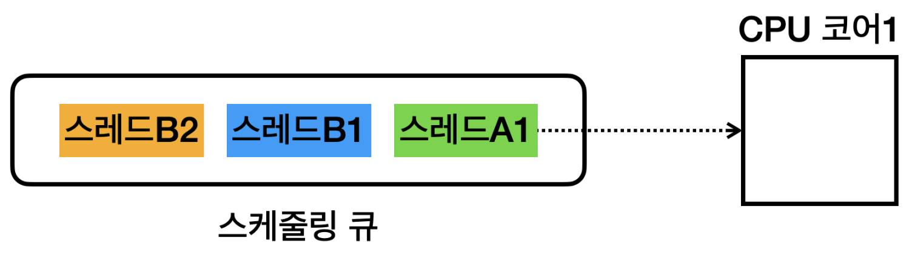

# 스레드와 스케줄링

- 각 작업은 프로세스-스레드, 두개의 식별자로 구분된다.
- 운영체제의 스케줄링 큐에 이 값들이 저장되고, 운영체제는 차례대로 실행하게 된다.
  - 실행한 후에는 큐의 마지막에 해당 스레드를 다시 넣는다.
- 코어가 여러개인 멀티 프로세싱 상황에서도 큐에서 스레드를 꺼내는 것은 동일하다.
- 어떤 프로그램이 얼마만큼 실행되는지 결정하는 것은 **스케줄링**이라고 한다.
  - 이는 운영체제가 CPU를 최대한 활용할 수 있는 우선순위와 최적화 기법을 사용한다.

