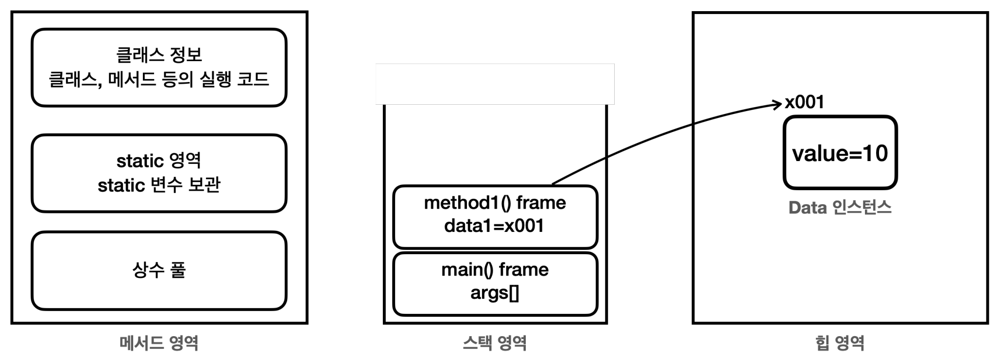

# 자바 메모리 구조

- **메서드 영역** : 프로그램을 실행하는데 필요한 모든 정보를 포함한다.
  - **클래스 정보** : 클래스의 실행코드, 메서드와 생성자등의 모든 실행 코드가 존재한다.
  - **static 영역** : static 변수를 보관한다.
  - **런타임 상수 풀** : 프로그램에 필요한 공통 리터럴 상수들을 보관한다.
- **스택 영역**
  - 자바 실행시 스레드별로 하나의 실행 스택이 생성된다.
  - 해당 실행 스택 위에 지역 변수, 중간 연산 결과등이 쌓인다.
  - 메서드가 호출될 때마다 스택 프레임이 하나씩 쌓인다.
- **힙 영역**
  - 객체 인스턴스와 배열이 생성되는 영역
  - GC가 일어나는 영역
