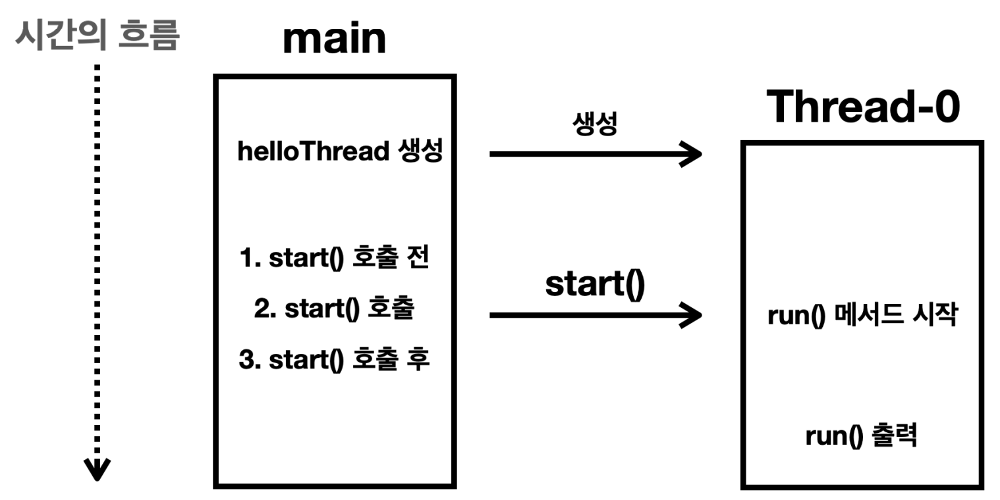

# 스레드 생성

- 기본적으로 main 스레드가 생성된다.
  - 또한 `main()` 메서드는 이 main 스레드가 실행한다.
  - 따라서 기본적으로 자바의 모든 코드는 main 스레드 위에서 실행된다.
- 특정 코드가 main 스레드가 아닌 다른 스레드에서 실행되도록 하고 싶다면?
  - `Thread` 클래스를 상속하고 `run()`을 오버라이딩한다.
  - 해당 클래스의 `start()`를 호출하면 자바는 스레드를 위한 별도의 스택공간을 할당받고 작동한다.
    - 이때, 별도의 이름을 부여하지 않으면 Thread-0과 같은 이름으로 생성된다.
  - **새로 생성된 스레드는 `run()` 메서드의 스택프레임을 스택에 올리면서 `run()` 메서드를 실행한다.**
- 중요한 것은 `run()`을 main 스레드가 실행시키는 것이 아니라는 것이다.
  - main 스레드는 Thread-0에게 실행시키라는 명령만 내리고 자기 할 일을 한다. (비동기)
- 이 흐름을 바로 **멀티스레드**라고 부른다.

```java
public class MyThread extends Thread {
    @Override
    public void run() {
        System.out.println(Thread.currentThread().getName());
    }
}
```



## 실행순서 정리

- 자바가 기본적으로 main 스레드를 생성한다.
- 자바가 기본적으로 main 스레드를 생성한다.
- Main은 main 메서드를 실행시키기 위해 main 메서드의 스택프레임을 스택에 올리고 실행한다.
- main 메서드 내부에서 MyThread.start()가 호출된다.
- Thread-0 스레드를 생성한다.
- Thread-0는 run() 메서드를 실행시키기 위해 run() 메서드의 스택프레임을 스택에 올리고 실행한다.
