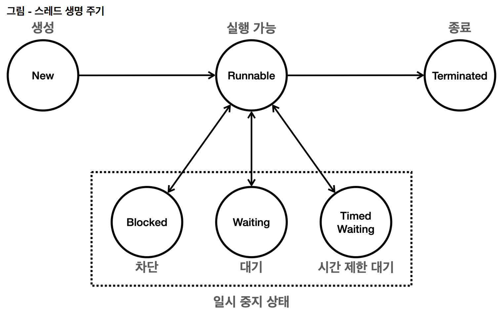

# 스레드 생명 주기



## NEW

- 스레드가 아직 실행되지 않은 상태
- 스레드 객체만 생성된 상태이다.

## RUNNABLE

- 스레드가 실행중이거나, 실행될 준비가 된 상태
- `Thread.start()`가 호출된 상태이며, 스케줄러의 실행 대기열에 들어가 있는 상태이다.
- 스케줄러의 실행 대기열에 들어가 있지만(실행되고 있지만), CPU 관점에서 동시에 하나만 실행할 수 있기 때문에 RUN이 아니라 `RUNNABLE`이라고 불린다.
- 애플리케이션 관점에서 보면 그냥 **실행 상태**라고 보면 된다.

## BLOCKED

- 스레드가 동기화 락을 기다리는 상태
- `synchronized` 블록에 진입하기 위해 락을 얻어야 하는 상태이다.
- 즉, 다른 스레드가 해당 락을 가지고 있는 경우이다.

## WAITING

- 스레드가 다른 스레드의 특정 작업이 완료되기를 무기한 기다리는 상태
- `wait()`, `join()` 메서드가 호출될 때 이 상태가 된다.
- 다른 스레드가 `notify()`를 호출하거나, `join()`이 완료되어야 끝난다.

## TIMED WAITING

- 스레드가 다른 스레드의 특정 작업이 완료되기를 기다리는 상태
- `sleep(), wait(), join()` 메서드가 호출될 때 이 상태가 된다.
- 주어진 시간이 경과하거나, 다른 스레드가 해당 스레드를 깨우면 이 상태에서 벗어난다.

## TERMINATED

- 스레드가 실행 종료된 상태
- 스레드가 정상적으로 종료되거나, 예외가 발생하여 종료된 경우이다.
- 한번 종료되면 다시 실행할 수 없다.

## 스레드 상태 전이

- NEW -> RUNNABLE : `start()` 호출
- RUNNABLE -> BLOCKED/WAITING/TIMED WAITING : 락을 얻지 못하거나, `wait()`, `sleep()` 호출
- RUNNABLE -> TERMINATED : `run()` 종료

## 상태 변이 실습

```java
public static void main(String[] args) throws InterruptedException {
	Thread thread = new Thread(new MyRunnable(), "myThread");
	MyLogger.log("MyThread.create : " + thread.getState());
	thread.start();
	Thread.sleep(1000);
	MyLogger.log("MyThread.sleeping: " + thread.getState());
	Thread.sleep(3000);
	MyLogger.log("MyThread.afterRun : " + thread.getState());
}
	
private static class MyRunnable implements Runnable {
	@Override
	public void run() {
		try {
			MyLogger.log("스레드 run 시작!");
			MyLogger.log("MyThread.running: " + Thread.currentThread().getState());
			MyLogger.log("스레드 sleep 시작!");
			Thread.sleep(3000);
			MyLogger.log("스레드 sleep 종료!");
			MyLogger.log("MyThread.afterSleep: " + Thread.currentThread().getState());
			MyLogger.log("스레드 run 종료!");
		} catch (InterruptedException e) {
			throw new RuntimeException(e);
		}
	}
}

// 결과
23:31:25.508 [     main] MyThread.create : NEW
23:31:25.510 [ myThread] 스레드 run 시작!
23:31:25.510 [ myThread] MyThread.running: RUNNABLE
23:31:25.510 [ myThread] 스레드 sleep 시작!
23:31:26.514 [     main] MyThread.sleeping: TIMED_WAITING
23:31:28.511 [ myThread] 스레드 sleep 종료!
23:31:28.512 [ myThread] MyThread.afterSleep: RUNNABLE
23:31:28.512 [ myThread] 스레드 run 종료!
23:31:29.521 [     main] MyThread.afterRun : TERMINATED
```
