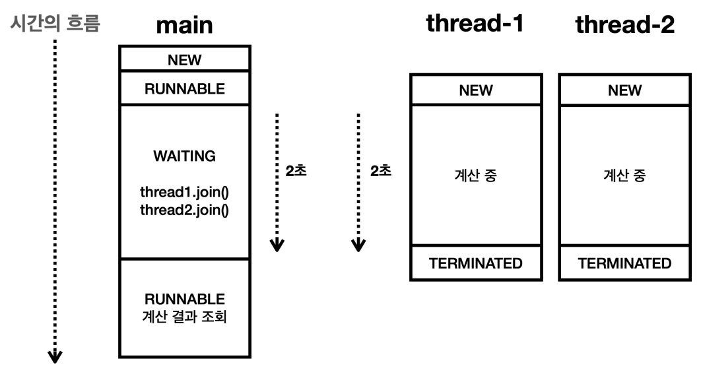

# Join

## Join은 왜 필요할까?

```java
public static void main(String[] args) {
	ThreadUtils.log("START");
	Thread thread1 = new Thread(new Job(), "Thread-01");
	Thread thread2 = new Thread(new Job(), "Thread-02");
	thread1.start();
	thread2.start();
	ThreadUtils.log("END");
}
	
private static class Job implements Runnable {
	
	@Override
	public void run() {
		ThreadUtils.log("작업 시작");
		ThreadUtils.sleep(2000);
		ThreadUtils.log("작업 완료");
	}
}
```

- 위와 같은 코드에서 main 스레드의 END 로그는 마지막에 남지 않는다.
- main 스레드는 다른 스레드가 종료될 때 까지 기다리지 않고, 명령만 내리고 자기 갈 길을 간다.
- 만약 다른 스레드에서의 결과값이 필요하다면? 다른 스레드의 종료를 기다려야 한다.
- 이럴 때 사용하는 것이 **Join**이다.

## Join을 사용하는 예제

- 스레드 1에서는 1~50까지 더하고, 스레드 2에서는 51~100까지 더하여 main 스레드에서는 이를 더하여 1~100까지의 덧셈을 2배 빠르게 구해보자.

```java
public static void main(String[] args) {
	ThreadUtils.log("START");
	Task task1 = new Task(1, 50);
	Task task2 = new Task(51, 100);
	Thread thread1 = new Thread(task1, "Thread-01");
	Thread thread2 = new Thread(task2, "Thread-02");
	thread1.start();
	thread2.start();
	ThreadUtils.log(task1.result);
	ThreadUtils.log(task2.result);
	ThreadUtils.log("result : " + (task1.result + task2.result));
	ThreadUtils.log("END");
}
	
private static class Task implements Runnable {
	
	private final int startValue;
	private final int endValue;
	public int result;
	
	public Task(int startValue, int endValue) {
		this.startValue = startValue;
		this.endValue = endValue;
	}
	
	@Override
	public void run() {
		ThreadUtils.log("작업 시작");
		ThreadUtils.sleep(2000);
		for (int i = startValue; i <= endValue; i++) {
			result += i;
		}
		ThreadUtils.log("작업 완료, result = " + result);
	}
}
```

- 안타깝지만 위 코드의 결과는 0이다.
- 각 스레드에서는 2초 후에 1275, 3775의 값이 뒤늦게 나온다.
- 즉, main 스레드에서 `task1.result + task2.result`는 두 스레드의 작업이 모두 끝나고 실행되어야 한다.


