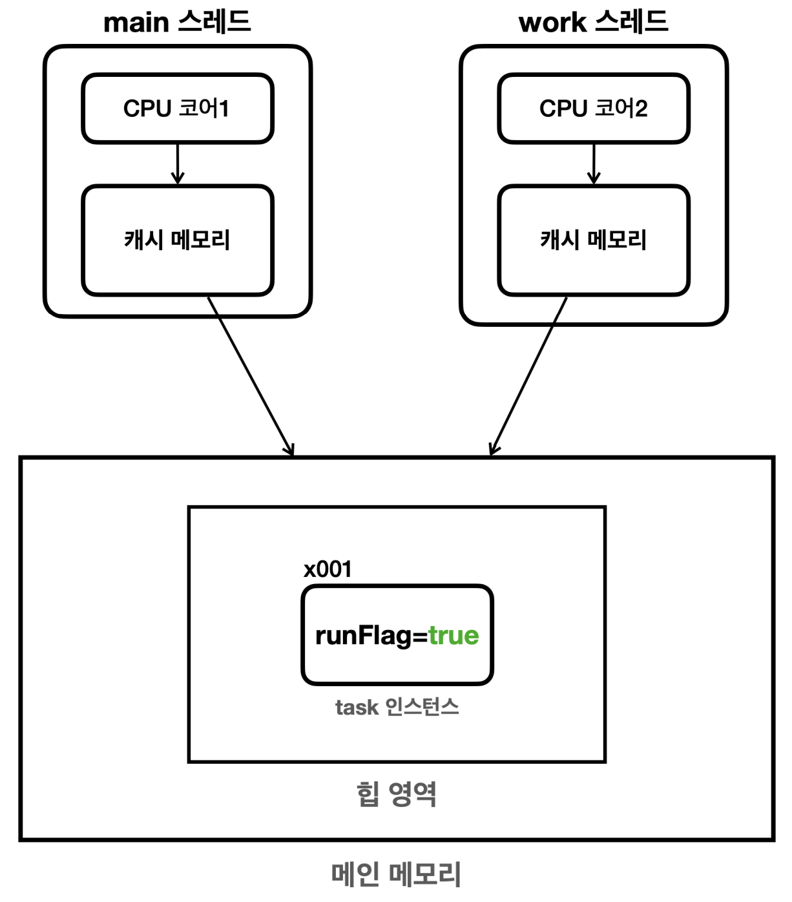
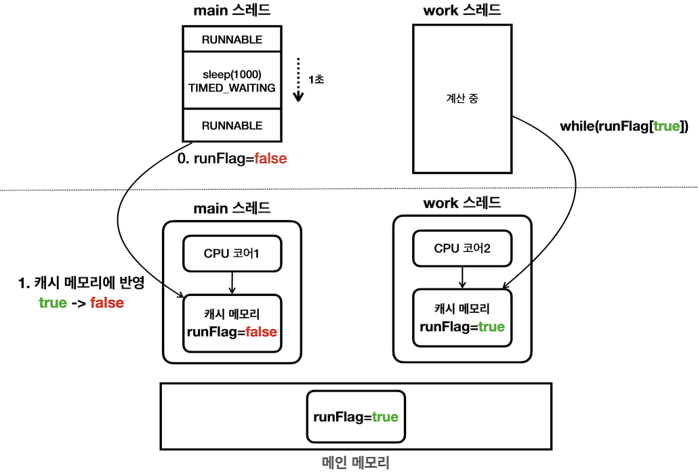

# 메모리 가시성이란?

- 두 스레드가 동일한 데이터를 참조한다고 가정해보자.
- 한 스레드에서 해당 데이터를 수정했을 때, 다른 스레드에서도 그것을 감지할 수 있을까?
- 당연히 그럴 것 같지만 안 그럴 수 있다.

## 왜?

- 보통 CPU 별로 각각의 캐시를 가지고 있다.
- 스레드1에서 데이터를 수정하면, 실제 메인 메모리의 데이터가 수정된다.
- 또한 스레드1이 돌아가는 CPU 코어의 캐시 메모리도 업데이트 된다.
- 하지만, 스레드2 입장에서 자기는 데이터를 수정한 적이 없다.
- **따라서 굳이 바뀐 메인 메모리를 참조하지 않고, 동일한 캐시 메모리만을 바라보고 있는다.**

## 그렇다면 캐시가 언제 업데이트될까?

- 주로 컨텍스트 스위칭 상황에서 캐시 메모리가 업데이트된다.
  - 하지만 또 무조건 그런 것은 아니다.
- 운이 좋다면 컨텍스트 스위칭이 일어나며 스레드2의 캐시가 업데이트 되고, 변경을 감지할 것이다.
- 이렇게 한 스레드에서 메모리가 보이는지 안 보이는지 애매한 문제를 **메모리 가시성**이라고 부른다.
