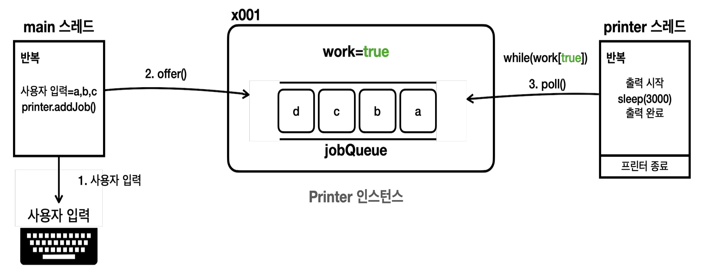

# 생산자-소비자 문제란?

- 생산자-소비자 문제를 이해하는 것은 멀티스레드를 다루는데에 중요하다.

## 용어 정리

- **생산자**
  - 데이터를 생산하는 역할
  - 위 그림에서는 `Printer`에 데이터를 입력하는 스레드가 생산자가 된다.
- **소비자**
  - 생성된 데이터를 사용하는 역할
  - 위 그림에서는 `Printer`에서 데이터를 받아서 출력하는 스레드가 소비자가 된다.
- **버퍼**
  - 생산자가 생성한 데이터를 임시로 저장하는 공간이다.
  - 생산자와 소비자는 이 버퍼를 통해서만 데이터를 주고받는다.
  - 한정된 크기를 갖는다.

## 문제는 언제 생길까?

- 문제는 생산자와 소비자 중 한쪽이 너무 빠를 때 발생한다.
- **생산자가 너무 빠르다면**, 버퍼가 가득차서 데이터를 더 넣을 수 없을 때까지 데이터를 생성한다. 이 경우 소비자가 데이터를 소비할 때까지 기다려야 한다.
- **소비자가 너무 빠르다면**, 버퍼가 비어서 데이터가 없을 때까지 데이터를 소비한다. 이 경우 생산자가 데이털르 생산할 때까지 기다려야 한다.
