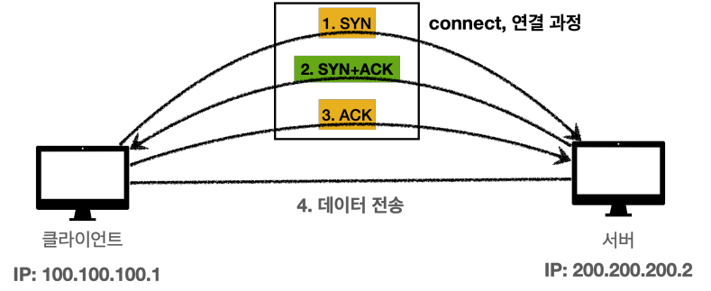

# TCP (Transmission Control Protocol)

- 특징
  - 연결 지향(3 way handshake)
  - 데이터 전달 보증 (메시지가 전달되지 않았다는 것을 감지 가능)
  - 순서 보장
  - 신뢰 가능

## TCP 3 way handshake

- 연결 과정을 통해 서로가 통신할 준비가 되었는지 확인 가능하다.

## 데이터 전달 보증

- 데이터를 전송하면, 대상 서버에서 데이터를 잘 받았다고 응답해준다.

## 순서 보장

- 최적화마다 다르지만 순서를 보장한다.
- 예를 들어, 패킷 순서가 잘못된 부분부터 다시 보내달라고 요청한다.
