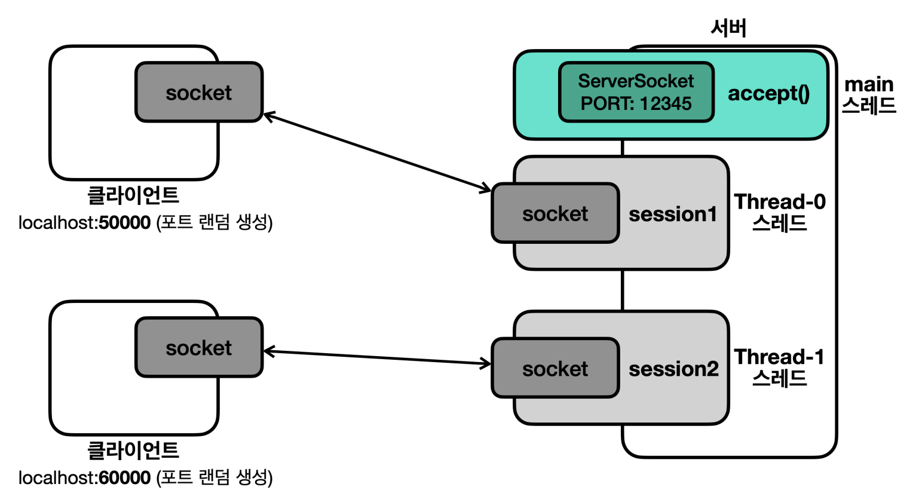

# 여러 클라이언트와의 연결

- 현재 코드는 서버가 하나의 클라이언트와만 연결될 수 있는 구조이다.
- 여러 클라이언트와 연결하려면 어떻게 해야할까?

## 소켓 생성 자세한 순서

- 서버는 `ServerSocket` 객체를 생성하며 해당 포트에서 리스닝을 시작한다.
- 클라이언트는 `Socket` 객체를 생성하며 서버와 연결을 시도한다.
  - 이때, 서버와 TCP 3 way handshake를 하게 된다.
  - TCP 3 way handshake가 정상적으로 성공한다.
  - 그 결과로 서버의 OS backlog queue에 해당 연결을 저장한다.
- 그 결과로 클라이언트는 `Socket` 객체 생성이 완료된다.
  - 하지만 아직 서버의 `Socket` 객체는 생성되지 않는다.
- 이후 서버의 `accept()` 메서드를 통해 `Socket` 객체 생성을 시도한다.
  - 이때, 서버는 OS backlog queue를 보면서 연결이 되었는지 확인한다.
  - 연결이 존재한다면 해당 정보를 OS backlog queue에서 삭제한다.
  - 이후 `Socket` 객체를 생성한다.
- 이렇게 되면 클라이언트와 서버 모두 `Socket` 객체를 가지게 되며, 자바 수준에서 연결이 완료된 것이다.

## 만약 여러 클라이언트에서 연결을 시도한다면?

- 여러 클라이언트에서 TCP 3 way handshake를 한다.
- 서버의 OS backlog queue에는 여러 연결 정보가 저장된다.
- 하지만 현재의 프로그램은 `accept()`를 한번만 호출하기 때문에 가장 먼저 연결을 시도한 클라이언트의 `Socket` 객체만을 가지게 된다.
- 물론 서버 측에서 `accept()`를 호출하지 않더라도, 이미 TCP 연결은 완료되었으므로 클라이언트는 서버에 메시지를 보낼 수 있다.

## 서버의 Socket 객체가 없어도 클라이언트가 송신할 수 있다고?

- 메시지는 다음과 같은 순서로 네트워크에 전파된다.
  - 클라이언트 송신 : 애플리케이션 -> OS TCP 송신 버퍼 -> 클라이언트 네트워크 카드
  - 서버 수신 : 서버 네트워크 카드 -> OS TCP 수신 버퍼 -> 애플리케이션
- 서버가 애플리케이션 수준에서 `Socket`을 생성하지 않더라도, **OS TCP 수신 버퍼에서 해당 메시지가 대기한다.**
- **즉, 서버 입장에서 `Socket` 객체가 없더라도 TCP 연결은 가능하다. 데이터 송수신을 위해서 `Socket` 객체가 필요하다.**

## 여러 클라이언트와 연결하기 위해서는 어떻게 해야할까?

- 현재 문제는 새로운 클라이언트가 접속했을 때, 이미 서버는 무한 반복을 돌고 있기 때문에 `accept()`할 수 없다.
- `accept()`, `readXXX()` 두 메서드 때문에 블로킹되기 때문에 한 블로킹 상황에서 다른 메서드를 호출할 수 없다.
- **결론 : 스레드가 필요하다.**
  - `accept()`를 통해 새로운 연결을 기다리는 스레드 1개
  - `readXXX()`를 통해 클라이언트의 메시지를 기다리는 스레드 N개



### 서버

```java
public class Server {
	
	private static final int PORT = 12345;
	
	public static void main(String[] args) throws IOException {
		log("서버 시작");
		ServerSocket serverSocket = new ServerSocket(PORT);
		log("서버 소켓 시작 - 리스닝 포트: " + PORT);
		
		while (true) {
			Socket socket = serverSocket.accept(); // 블로킹
			log("소켓 연결: " + socket);
			
			Session session = new Session(socket);
			Thread thread = new Thread(session);
			thread.start();
		}
	}
}
```

### 세션

```java
public class Session implements Runnable {
	
	private final Socket socket;
	
	public Session(Socket socket) {
		this.socket = socket;
	}
	
	@Override
	public void run() {
		try {
			DataInputStream input = new DataInputStream(socket.getInputStream());
			DataOutputStream output = new DataOutputStream(socket.getOutputStream());
			
			while (true) {
				String received = input.readUTF();
				log("server <- client: " + received);
				
				if (received.equals("exit")) {
					break;
				}
				
				String toSend = received + " WORLD!";
				output.writeUTF(toSend);
				log("server -> client: " + toSend);
			}
			
			log("연결 종료: " + socket);
			output.close();
			input.close();
			socket.close();
		} catch (IOException e) {
			throw new RuntimeException(e);
		}
	}
}
```
