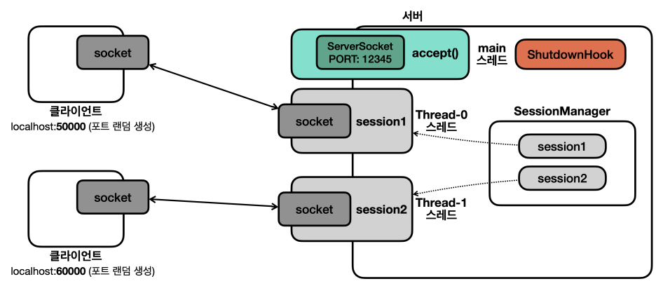
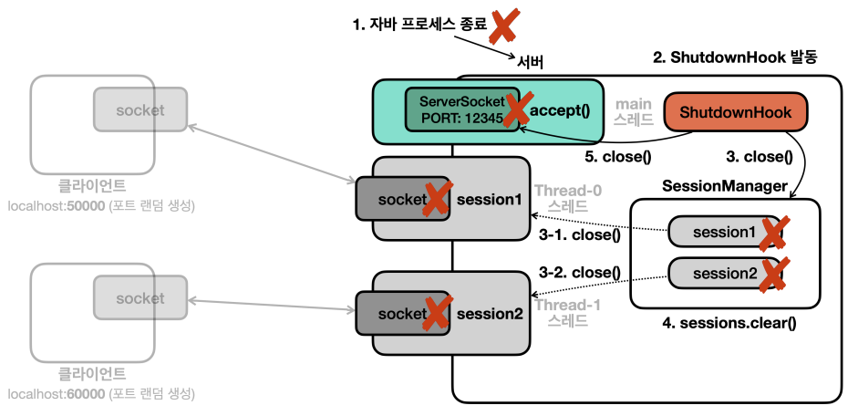

# 셧다운 훅 통한 자원 정리

- 서버는 어떻게 종료해야 할까?
- 서버도 콘솔창을 통해서 exit를 입력하면 종료하도록 설계할 수 있지만, 보통 서버에서 그런 콘솔 입력을 잘 지원하지 않는다.
- 서버를 직접 종료하면서도 자원 정리를 해야 한다.

## 셧다운 훅

- 정상 종료
  - 모든 non 데몬 스레드의 실행 완료
  - 사용자의 `Ctrl + C`
  - `kill` 명령 전달
  - Intellij의 stop 버튼
- 강제 종료
  - OS가 프로세스를 더 이상 유지할 수 없다고 판단
  - 리눅스/유닉스의 `kill -9`, 윈도우의 `taskkill /F`
- 정상 종료의 경우에는 셧다운 훅이 작동하여, 프로세스 종료 전에 필요한 후처리를 할 수 있다.
- 강제 종료는 셧다운 훅이 작동하지 않으며, 자원 정리도 제대로 이루어지지 않을 수 있다.
- 우리는 셧다운 훅에 서버 자원 정리를 걸어놓으면 된다.

## 세션 매니저




- 서버를 종료할 때 사용하는 세션들도 함께 종료해야 한다.
- 따라서 세션들을 가지고 있고 관리할 수 있는 객체가 필요하다.
- 이것을 세션 매니저라고 부른다.
- 세션 매니저는 여러 스레드에서 메서드를 호출하거나, 정리 중에 다른 세션이 추가되는 등의 동시성 문제를 고민해야 한다.

```java
public class SessionManagerV4 {
	
	private final List<SessionV4> sessions = new ArrayList<>();
	
	public synchronized void add(SessionV4 session) {
		sessions.add(session);
	}
	
	public synchronized void remove(SessionV4 session) {
		sessions.remove(session);
	}
	
	public synchronized void closeAll() {
		for (SessionV4 session : sessions) {
			session.close();
		}
		sessions.clear();
	}
}
```

## 세션 코드 수정

```java
public class SessionV4 implements Runnable {
	
	private final Socket socket;
	private final DataInputStream input;
	private final DataOutputStream output;
	private final SessionManagerV4 sessionManager;
	private boolean closed;
	
	public SessionV4(Socket socket, SessionManagerV4 sessionManager) throws IOException {
		this.socket = socket;
		this.input = new DataInputStream(socket.getInputStream());
		this.output = new DataOutputStream(socket.getOutputStream());
		this.sessionManager = sessionManager;
		this.sessionManager.add(this);
	}
	
	@Override
	public void run() {
		try {
			while (true) {
				String received = input.readUTF();
				log("server <- client: " + received);
				
				if (received.equals("exit")) {
					break;
				}
				
				String toSend = received + " WORLD!";
				output.writeUTF(toSend);
				log("server -> client: " + toSend);
			}
		} catch (IOException e) {
			log(e);
		} finally {
			close();
			sessionManager.remove(this);
		}
	}
	
	// 세션 종료, 서버 종료 상황에서 모두 호출될 수 있으며, 동시에 호출될 수도 있다.
	// 동시성 고민을 해서 작성해야 한다.
	public synchronized void close() {
		if (closed) {
			return;
		}
		SocketCloseUtil.closeAll(socket, input, output);
		closed = true;
	}
}
```

- 이제 **서버 종료**와 **세션 종료** 두 상황에서 자원 정리가 필요하므로 `try-with-resources`를 사용할 수 없다.
- 대신 `finally`에서 직접 메서드를 호출해주는 식으로 구성한다.
- 이러면 `try`문 종료시에도 자원 정리가 되고, 외부에서 `close()` 메서드를 호출해도 자원 정리가 된다.
- 또한 이 자원정리가 중복호출될 위험이 있으므로 `synchronized` 키워드와 플래그를 사용한다.

## 서버 코드 수정

### 셧다운 훅 코드

```java
private static class ShutdownHook implements Runnable {
		
		private final ServerSocket serverSocket;
		private final SessionManagerV4 sessionManagerV4;
		
		public ShutdownHook(ServerSocket serverSocket, SessionManagerV4 sessionManagerV4) {
			this.serverSocket = serverSocket;
			this.sessionManagerV4 = sessionManagerV4;
		}
		
		@Override
		public void run() {
			log("셧다운 훅 실행");
			try {
				sessionManagerV4.closeAll();
				serverSocket.close();
				Thread.sleep(1000);
			} catch (IOException | InterruptedException e) {
				log(e);
			}
		}
	}
```

### 서버 코드

```java
public class ServerV4 {
	
	private static final int PORT = 12345;
	
	public static void main(String[] args) throws IOException {
		log("서버 시작");
		ServerSocket serverSocket = new ServerSocket(PORT);
		SessionManagerV4 sessionManager = new SessionManagerV4();
		log("서버 소켓 시작 - 리스닝 포트: " + PORT);
		
		// 셧다운 훅 등록
		ShutdownHook shutdownHook = new ShutdownHook(serverSocket, sessionManager);
		Runtime.getRuntime().addShutdownHook(new Thread(shutdownHook, "shutdown"));
		
		
		while (true) {
			Socket socket = serverSocket.accept(); // 블로킹
			log("소켓 연결: " + socket);
			
			SessionV4 session = new SessionV4(socket, sessionManager);
			Thread thread = new Thread(session);
			thread.start();
		}
	}
}
```

## 정리

### 클라이언트 작동

- exit를 보낼 시 `try-with-resources` 구문을 통해 자원을 정리하고 종료한다.
- 기타 정상 종료시 `try-with-resources` 구문을 통해 자원을 정리하고 종료한다.

### 서버 작동

- 셧다운 훅
  - 서버 정상 종료시 호출되는 코드이다.
  - 서버의 `ServerSocket`과 세션 매니저를 종료해준다.
- 세션 매니저
  - 세션들을 등록해 놓는다.
  - `closeAll()` 메서드 호출시 가진 세션들의 `close()` 메서드를 일괄적으로 호출해준다.
- 세션
  - exit를 받을 시 `finally` 구문의 `close()` 메서드를 통해 자원을 정리하고 종료한다.
  - 서버 정상 종료시 세션 매니저에 의해 호출된 `close()` 메서드를 통해 자원을 정리하고 종료한다.
- 세션 종료 흐름
  - exit 종료 : 세션 자원 정리 -> 세션 매니저에서 제거
  - 서버 정상 종료 : 셧다운 훅 -> 세션 매니저에서 세션 `close()` 호출 -> 세션 자원 정리
