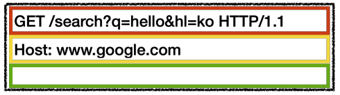
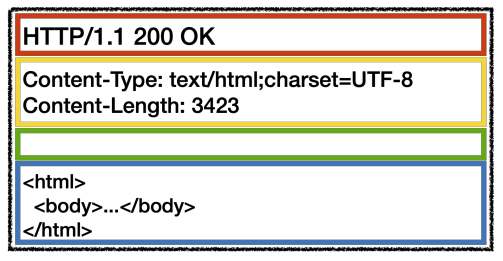

# HTTP 기본 이론

- 현대의 웹 환경은 **HTTP**라는 프로토콜을 통해서 데이터를 주고 받는다.
- 웹 브라우저는 읽은 정보를 HTTP 요청으로 바꿔주거나, HTTP 응답을 보여주는 역할을 한다.

## HTTP 메시지 구조

- 다음 4개의 부분으로 나뉜다.
  - 시작라인
  - 헤더
  - 공백라인 1줄
  - 메시지 바디
- 내용은 요청/응답이냐에 따라 다르다.
- 구조는 동일하다.

### 요청 메시지 구조

### 응답 메시지 구조

### 시작 라인

- HTTP 메서드
  - 동작을 지정한다.
  - GET, POST, PUT 등이 존재한다.
- 요청 대상
  - `절대경로?쿼리` 구조이다.
- 버전
  - HTTP 버전이다.
  - 1.1이 대표적이다.
- 상태 코드
  - 요청 성공/실패 등의 상태를 나타낸다.
  - 200, 400, 401, ...
- 이유 문구
  - 상태 코드에 따른 짧은 상태 코드 설명

### 헤더

- HTTP 전송에 필요한 모든 부가 정보를 포함한다.
- 예를 들어,
  - 메시지 바디의 종류
  - 문자 집합 종류
  - 메시지 바디의 길이
  - **인증 정보**
  - 캐시 정보
  - ...
- 필요하면 임의 헤더를 추가할 수 있다.

### 메시지 바디

- 실제 전송할 데이터
- HTML 문서, 이미지, 영상, JSON 등 byte로 표현 가능한 모든 데이터를 전송할 수 있다.
