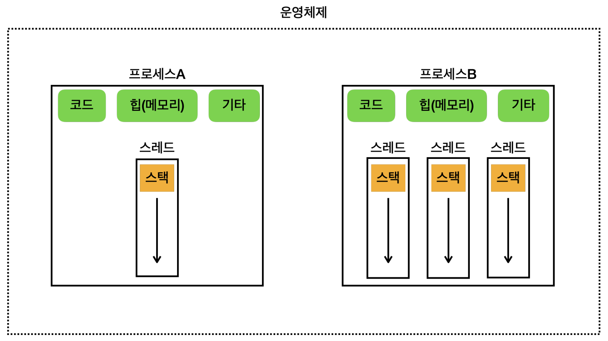

# 프로세스와 스레드

## 프로세스

- 프로그램은 기본적으로 파일이다.
  - 이 파일을 운영체제 내에서 실행시키면 프로세스라고 부른다.
  - 각 프로세스는 독립적으로 실행되며, 격리되어 있다.
- 프로세스의 메모리 구성
  - **코드** : 실행할 프로그램의 코드가 저장되는 부분
  - **데이터** : 전역 변수 및 정적 변수가 저장되는 부분
  - **힙(메모리)** : *동적으로 할당*되는 메모리 영역
  - **스택** : 메서드 호출 시 생성되는 *지역변수*와 *반환주소*가 저장되는 영역(스레드에 포함)
- 정리하면 프로세스는 실행 환경과 자원을 제공하는 컨테이너이다.

## 스레드

- 프로세스 내에서 실행되는 작업의 단위
  - 코드를 실제로 실행하는 주체이다.
  - 프로세스의 코드를 스레드가 실행하는 것이다.
- 프로세스에 비해 만들고 관리하기 쉽다. (가볍다.)
- 스레드의 메모리 구성
  - **공유 메모리** : 해당 스레드를 포함하는 프로세스의 코드, 데이터, 힙을 포함하며 다른 스레드와 공유된다.
  - **개별 스택** : 각 스레드가 지닌 자신만의 공간
- 정리하면 스레드는 프로세스가 제공한 환경에서 실제로 CPU를 사용하여 코드를 실행하는 작업자이다.ㅓ
