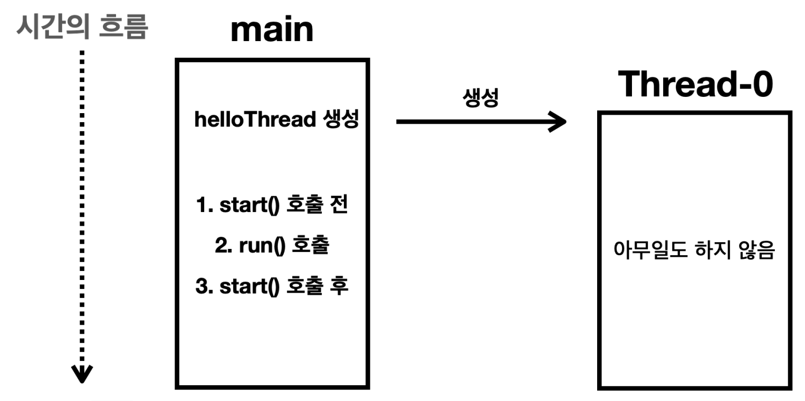

# 스레드 실행

## 실행순서 정리

- 자바가 기본적으로 main 스레드를 생성한다.
- Main은 main 메서드를 실행시키기 위해 main 메서드의 스택프레임을 스택에 올리고 실행한다.
- main 메서드 내부에서 MyThread.start()가 호출된다.
- Thread-0 스레드를 생성한다.
- Thread-0는 run() 메서드를 실행시키기 위해 run() 메서드의 스택프레임을 스택에 올리고 실행한다.

## 만약 run()을 바로 실행하면

- `start()` 메서드는 `run()` 실행전에 스택 공간을 할당하여 스레드를 만들고, 해당 스레드에서 실행될 수 있도록 한다.
- 따라서 만약 바로 `run()`을 실행하면 그냥 `main` 스레드에서 실행된다.

